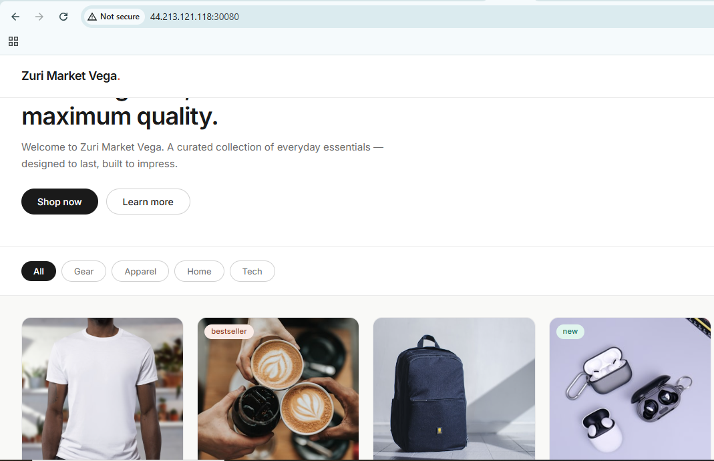

# Zuri Market — Frontend

## Architecture Diagram


## 1. Project Overview

This is the React frontend for Zuri Market. It displays products fetched from the backend API, lets the user filter products by category, and includes a cart with quantity management. The user sees a storefront — a hero banner, a filterable product grid, and a slide-out cart — and every product/store request goes to a separate backend API over HTTP.

## 2. Tech Stack

- **React** 18.3
- **Vite** 7.3 (dev server + production bundler)
- **@vitejs/plugin-react** — React Fast Refresh support for Vite
- Plain CSS (custom properties), no CSS framework
- **Node.js** 20 required to install dependencies and run the dev server/build (the Docker image is built on `node:20-alpine`)

## 3. Project Structure

```
zuriapp-frontend/
├── .github/
│   └── workflows/
│       └── frontend-ci.yml        # CI/CD: test, audit, build, scan, push, deploy to k3s
├── k8s/
│   └── frontend-deployment.yaml         # Kubernetes Deployment + NodePort Service
    └── frontend-service.yaml
├── src/
│   ├── components/
│   │   ├── Navbar.jsx          # Store name, nav links, cart button with item-count badge
│   │   ├── Hero.jsx             # Landing banner: headline, intro copy, CTA buttons
│   │   ├── FilterBar.jsx        # Category filter pills (All / Gear / Apparel / Home / Tech)
│   │   ├── ProductGrid.jsx      # Grid layout + loading skeletons, error state, empty state
│   │   ├── ProductCard.jsx      # Single product card with image, price, "Add to cart"
│   │   └── CartSidebar.jsx      # Slide-out cart: line items, quantity steppers, subtotal
│   ├── hooks/
│   │   └── useCart.js            # Cart state: add/remove/update/clear, derived count & total
│   ├── App.jsx                    # Top-level state, data fetching, wires everything together
│   ├── main.jsx                    # React root render
│   └── index.css                    # Global styles & CSS custom properties (theme variables)
├── index.html                          # HTML entry point, loads /src/main.jsx as a module
├── vite.config.js                       # Dev server port + /api proxy to the backend
├── Dockerfile                            # Two-stage build: Node build stage → Nginx runtime
├── .dockerignore
├── .env.example                            # Template listing required environment variables
├── .gitignore
├── package.json
└── package-lock.json
```

- **`vite.config.js`** — Fixes the dev server to port `3000` and proxies any `/api/*` request to the backend URL set in `VITE_API_URL`.
- **`index.html`** — The single HTML page Vite serves; it just mounts the React app via `/src/main.jsx`.
- **`Dockerfile`** — Builds the production image (see [Docker](#7-docker) below).
- **`k8s/frontend-deployment.yaml`** — Describes how the app runs in Kubernetes once deployed.
- **`.github/workflows/frontend-ci.yml`** — The pipeline that builds, scans, pushes, and deploys the app on every push to `main`.

### `src/` in detail

- **`Navbar.jsx`** — Renders the store name and a cart button with an item-count badge. Receives `storeName`, `cartCount`, `onCartOpen`.
- **`Hero.jsx`** — Renders the landing banner/headline below the navbar. Receives `storeName`.
- **`FilterBar.jsx`** — Renders the row of category pills (`all`, `gear`, `apparel`, `home`, `tech`). Receives `activeCategory`, `onCategoryChange`.
- **`ProductGrid.jsx`** — Renders the grid of products, or a skeleton/error/empty state depending on fetch status. Receives `products`, `loading`, `error`, `onAddToCart`.
- **`ProductCard.jsx`** — Renders a single product (image, category, name, description, price, "Add to cart" button). Receives `product`, `onAddToCart`.
- **`CartSidebar.jsx`** — Renders the slide-out cart with line items, quantity steppers, subtotal, and checkout/clear buttons. Receives `cartItems`, `cartTotal`, `onRemove`, `onUpdateQuantity`, `onClear`, `onClose`.
- **`useCart.js`** — Custom hook holding cart state and exposing `cartItems`, `addToCart`, `removeFromCart`, `updateQuantity`, `clearCart`, `cartCount`, `cartTotal`.
- **`App.jsx`** — Fetches `/api/store` and `/api/products` on load and whenever the active category changes, manages cart-sidebar open/close state, and passes data/handlers down to every component above.

## 4. Environment Variables

| Variable | Description |
|---|---|
| `VITE_API_URL` | Base URL of the backend API (e.g. `http://localhost:5000`) |
| `VITE_STORE_NAME` | Fallback store name shown if the `/api/store` request fails |

Vite only exposes environment variables to browser code if they're prefixed with `VITE_`. Any variable without that prefix (e.g. just `API_URL`) will be `undefined` in the app — it exists in the build environment but is never injected into the client bundle. This is a Vite security default, not a bug, so don't drop the prefix when adding new variables.

Copy `.env.example` to `.env` and fill in your values before running the app:

```bash
cp .env.example .env
```

## 5. Running Locally

```bash
# 1. Clone the repo
git clone https://github.com/tomide-dev/zuri-frontend-vega.git
cd zuriapp-frontend

# 2. Install dependencies
npm install

# 3. Set up environment variables
cp .env.example .env
# then edit .env and set VITE_API_URL / VITE_STORE_NAME

# 4. Start the dev server
npm run dev
```

The dev server starts on **`http://localhost:3000`** (port is fixed in `vite.config.js`). Any request to `/api/*` is proxied from there to whatever `VITE_API_URL` resolves to, so the browser always talks to `localhost:3000` and never needs CORS configured for local dev.

The backend API must also be running (at the URL set in `VITE_API_URL`, default `http://localhost:5000`) for the storefront to load — without it, the product grid will show its error state and the store name will fall back to `VITE_STORE_NAME`.

## 6. Building for Production

```bash
npm run build
```

This runs `vite build` and outputs a static, optimized bundle to the `dist/` folder. `dist/` is what gets copied into the Nginx layer of the Docker image — it's the only build artifact the container ever serves. It's excluded from Git (see `.gitignore`) since it's generated on every build, not checked-in source.

You can sanity-check the production build locally before deploying:

```bash
npm run preview
```

## 7. Docker

```bash
docker build -t tomidedev/zuriapp-frontend .
docker run -p 3000:80 tomidedev/zuriapp-frontend
```

Docker Hub image: **`tomidedev/zuriapp-frontend`**

> In the CI/CD pipeline, `VITE_API_URL` is set to the backend's NodePort address on the EC2 host (`http://<EC2_PUBLIC_IP>:30080`) at build time, since `VITE_API_URL` gets baked into the static bundle — it can't be changed after the image is built.

## 8. Deployment

The underlying k3s cluster and supporting AWS infrastructure (EC2 instance, IAM roles, Secrets Manager entries, etc.) are provisioned with **Terraform**. 

The provisioning code lives in [Zuri Market - Infrastructure](https://github.com/tomide-dev/zuri-market-vega-infra.git) — refer to it for setup and teardown instructions; this README only covers the application deployment itself.

Deployment is fully automated via **GitHub Actions** (`.github/workflows/frontend-ci.yml`) using two jobs. On every push to `main`, the pipeline installs dependencies, runs tests and `npm audit`, builds the Docker image, and if the scan passes it pushes the image to Docker Hub and rolls it out to the **k3s** cluster running on the EC2 Instance.

Edit this file as well as your **Kubernetes Manifests** (`.k8s/frontend-deployment.yaml`) to match your configurations

The frontend Service is exposed via Kubernetes NodePort on port 30080, making the app reachable externally at:

`http://<EC2_PUBLIC_IP>:30080`

### Push to your remote GitHub Repo

You now have everything in place. Commit the entire application code to your GitHub repo and push everything to main. This is what triggers the first full deployment.

```bash
git add .
git commit -m "Your_Commit_Message"
git push origin main
```
From this point on, every push to main triggers the full pipeline automatically.

Once the pipeline runs successfully, verify the deployment from your EC2 Instance:

```bash
kubectl get pods -n zurimarket      
# both backend and frontend pods should show Running
kubectl get services   
# confirm frontend-service shows nodePort 30080
# and backend-service shows nodePort 30893
```

## 9. Secrets

Secrets are sourced differently depending on where the app is running:

- **Locally** — secrets come from your own `.env` file (created from `.env.example`), and are never committed to the repo.
- **In the CI/CD pipeline** — secrets used to build, scan, and push the image, and then deploy to the k3s cluster on AWS (e.g. `DOCKERHUB_USERNAME`, `DOCKERHUB_TOKEN`, `AWS_ACCESS_KEY_ID`, `AWS_SECRET_ACCESS_KEY`, `EC2_PUBLIC_IP`, `SSH_PRIVATE_KEY`, `KUBECONFIG_DATA`) are stored as **GitHub Actions Secrets** and injected into the workflow at runtime — they're never hardcoded in the YAML.
- **In production** — the actual application secrets (`API_SECRET_KEY`, `STORE_NAME`) are stored in **AWS Secrets Manager**. 

## 10. Final Project Expectation

You should be able to Access the live App at `http://44.213.121.118:30080` as shown below



### Overall Project Recommendation 

| Improvement | Why it matters |
|---|---|
| Multi-environment pipeline with dev, staging, and production | All changes currently go directly to production on every push to main. A dev → staging → prod promotion model with environment-scoped GitHub Secrets means changes are validated in a lower environment before reaching real users. |
| Add HTTPS and TLS across all services end to end | All traffic currently travels over plain HTTP between the user and the frontend, and between the frontend and the backend API. HTTPS is non-negotiable for production: it protects data in transit, is required for modern browser APIs, and is expected by users. |
| Deploy a logging, monitoring, and alerting solution (ELK stack, CloudWatch or Prometheus + Grafana) | There is currently no visibility into pod health, API response times, error rates, or resource usage after deployment. Without monitoring you are blind to problems until users report them. CloudWatch or a Prometheus/Grafana stack surfaces issues proactively. |

The recommendations above are not exhaustive but represent a solid foundation for evolving the project into a production-ready solution that adheres to modern DevOps principles, security standards, scalability requirements, and engineering best practices.

---

*Author [Tomide Olubanjo](linkedin.com/in/oluwatomide-olubanjo)*